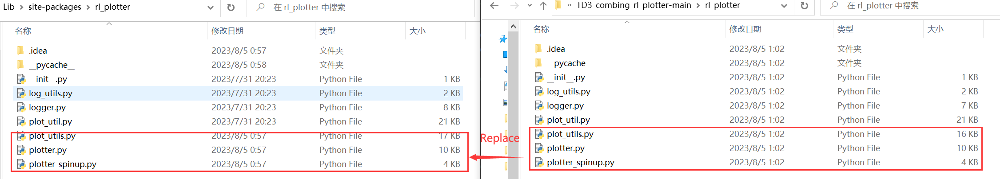

# TD3_combing_rl_plotter-main

A enchanced implementation of [rl_plotter](https://github.com/gxywy/rl-plotter) , a plotter for reinforcement learning (RL).

### Installation
Install rl_plotter from PIP
```
pip install rl_plotter
```
Git clone this repository
```
git clone git@github.com:long246/TD3_combing_rl_plotter.git
```
Replace the three files (plot_utils, plotter, and plotter_spinup.py in conda package) with the three file in this repository.
For me, this three file is in the path :
```
D:\home\user\Anaconda\Lib\site-packages\rl_plotter
```

### Usage
#### Method 1
```
cd results
rl_plotter --save  --pdf --avg_group --shaded_std
```
#### Method 2 (Recommended)
Batch plotting with two files (plot.sh and data_processing) newly added by running:
```
bash plot.sh
```

### More specific usage

you can find all parameters which can custom the style of your curves using `help`

```
rl_plotter --help
```
Newly added usage 
```
optional arguments:
--pdf                 save file as pdf
--file_name           where to save as? (such as ./halfcheetah)
--legend_fontsize     the fontsize of legend
```
[original usage](https://github.com/gxywy/rl-plotter)
```
optional arguments:
-h, --help            show this help message and exit
--fig_length          matplotlib figure length (default: 8)
--fig_width           matplotlib figure width (default: 6)
--style               matplotlib figure style (default: seaborn)
--title               matplotlib figure title (default: None)
--xlabel              matplotlib figure xlabel
--xkey                x-axis key in csv file (default: l)
--ykey                y-axis key in csv file (support multi) (default: r)
--yduel               duel y axis (use if has two ykeys)
--ylabel              matplotlib figure ylabel
--smooth              smooth radius of y axis (default: 10)
--resample            if not zero, size of the uniform grid in x direction
                      to resample onto. Resampling is performed via
                      symmetric EMA smoothing (see the docstring for
                      symmetric_ema). Default is zero (no resampling). Note
                      that if average_group is True, resampling is
                      necessary; in that case, default value is 512.
                      (default: 512)
--smooth_step         when resampling (i.e. when resample > 0 or
					  average_group is True), use this EMA decay parameter
                      (in units of the new grid step). See docstrings for
                      decay_steps in symmetric_ema or one_sided_ema functions. 
                      (default: 1.0)
--avg_group           average the curves in the same group and plot the mean
--shaded_std          shaded region corresponding to standard deviation of the group
--shaded_err          shaded region corresponding to error in mean estimate of the group
--legend_loc          location of legend
--legend_outside      place the legend outside of the figure
--borderpad           borderpad of legend (default: 0.5)
--labelspacing        labelspacing of legend (default: 0.5)
--no_legend_group_num don't show num of group in legend
--time                enable this will activate parameters about time
--time_unit           parameters about time, x axis time unit (default: h)
--time_interval       parameters about time, x axis time interval (default: 1)
--xformat             x-axis format
--xlim                x-axis limitation (default: None)
--log_dir             log dir (default: ./)
--filters             filter of dirname
--filename            csv filename
--show                show figure
--save                save figure
--dpi                 figure dpi (default: 400)
```

### Acknowledgment
The core of this funtion newly added is conducted by  [ALiShan](https://github.com/ALiShan-RL)